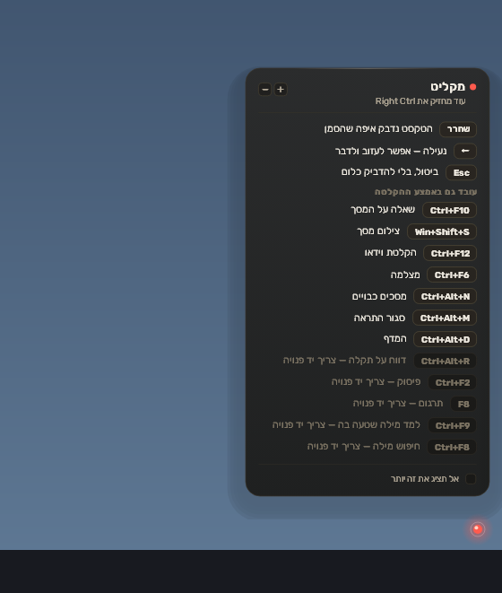
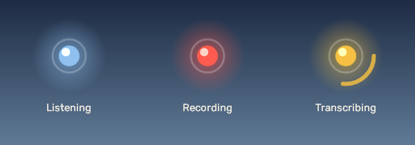
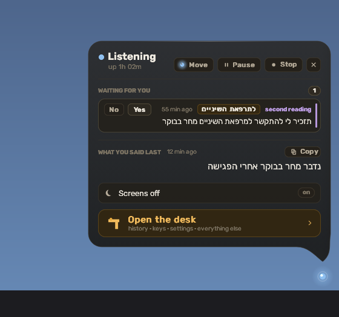
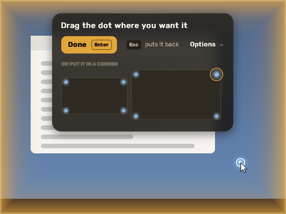
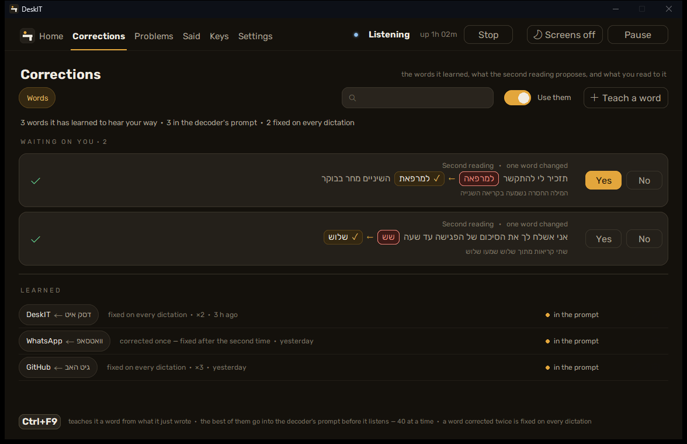

[עברית](../he/03-dictating) · English

# 3. Dictating

**The two-sentence version.** Click where you want the text, hold **Right Ctrl**, speak,
release — the Hebrew appears at the cursor. Everything else in this chapter is a refinement of
that one movement.

## Hold, latch, English

- **Hold and talk.** Hold **Right Ctrl**, speak, let go. While the key is down a small card
  (the hint) says what the other keys do at this moment.
- **Latch.** While holding Right Ctrl, tap **←** (the left arrow): the recording locks on, let
  go of Ctrl and talk as long as you want. Tap ← again to transcribe, **Esc** to discard.
- **English.** DeskIT notices a sentence spoken in English when the English detector is
  installed ([chapter 2](02-first-run), NVIDIA cards only) and transcribes it as English.
  There is also a separate "Dictate English" key you can bind on the **Keys** place.

## The dot

A small dot sits in a corner of your main screen (**Settings > General** chooses the corner).
Its colour is the state:

| colour | meaning |
|---|---|
| cool blue | listening — hold the key whenever you like |
| red | recording now |
| red, breathing | latched: recording without the key held |
| amber | transcribing, or busy with a cloud pass |
| grey, no glow | paused (the pause key, or a full-screen game) |

Click the dot and a panel (the shelf) opens beside it — a speech bubble pointing at the dot,
wherever the dot is: what the app is doing, what is waiting for you, and the last things you
said.

**Move**, at the top of the panel, puts the dot where you like: the panel closes, a warm light
comes up round every screen, and you press and hold the dot and drag it anywhere — on any
screen, as many times as you want. **Done** (the small card at the top of the screen) or
**Enter** keeps it there; **Esc** puts it back. **Options** on that card opens a little map of
your screens with a dot in every corner — click one and the dot goes there. The same thing is
on **Settings > General** as **Move the dot**.

## Where the text goes

The transcript is put on the Windows clipboard and pasted with Ctrl+V into the window under
the cursor; the clipboard is then restored. Two consequences worth knowing:

- **Windows clipboard history** (Win+V) may keep earlier transcripts if you turned that
  Windows feature on, and Windows' cloud clipboard sync would send them to Microsoft. That is
  Windows' doing, not DeskIT's; DeskIT keeps its own history for the days you set
  ([chapter 8](08-your-data)).
- **Windows running as administrator** (an elevated window) refuses pastes from a normal
  program — Windows' rule, not DeskIT's. The text is on your clipboard: press Ctrl+V there
  yourself. DeskIT never runs elevated.

## Correcting a word

Tap **Ctrl+F9** right after a dictation with a misheard word: a card shows the sentence, pick
the wrong word and type the right one. DeskIT learns the pair and applies it to later
dictations.

The **Corrections** place lists every pair it knows, newest first, with a search over them.
**Teach a word** adds a pair by hand — for a word it keeps getting wrong the same way — and it
is fixed on every dictation from then on; the pencil on a row changes a pair, the cross takes
it out (on every PC of your account). The **Use them** switch turns the whole list off without
losing it.

DeskIT also reads each dictation a second time on its own (the second reading) and proposes a
correction when two readings disagree; the proposal is a card with **Yes** and **No**, and it
waits at the top of the Corrections place too. The sentence is shown around the change: what
it heard on a red pill, an arrow, and what it proposes on a gold one with a tick. On a PC
without an NVIDIA card the second reading is off.

## The other keys

| key | does |
|---|---|
| Ctrl+F2 | punctuate what was just pasted |
| F8 | translate the selection |
| Ctrl+F8 | look up the selected word |
| Ctrl+F10 | ask about the screen ([chapter 7](07-screen)) |
| Win+Shift+S | screenshot ([chapter 7](07-screen)) |
| Ctrl+F12 | record the screen |
| Insert | pause / resume |
| Ctrl+Alt+R | report a problem ([chapter 9](09-reporting)) |

All of them are on the dashboard's **Keys** place, lit on a drawn keyboard, and can be
rebound there.
