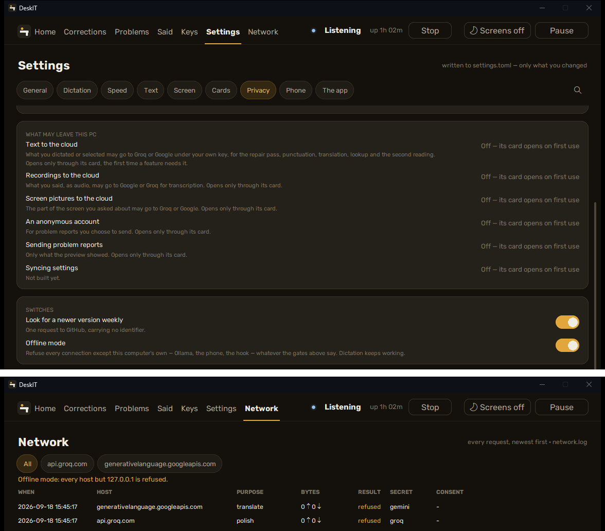

[עברית](../he/04-privacy) · English

# 4. Privacy, and how to check it yourself

Your voice stays on this computer. The words you say are kept in one folder you can delete.
Nothing is sent anywhere until you switch it on.

Every claim below comes with a way to check it that does not require trusting us. Four of the
checks take ten minutes together; two more are for the sceptic with an afternoon.

## Where things are

- **Your data:** `%LOCALAPPDATA%\DeskIT` — the model, your learned words, history, the last
  recordings, reports. One folder ([chapter 8](08-your-data)).
- **Your cloud keys**, if you add any: Windows Credential Manager, as `DeskIT/groq` and
  `DeskIT/gemini` — never in a DeskIT file ([chapter 5](05-cloud)).
- **Every connection:** the dashboard's **Network** place and `logs\network.log` in your
  folder. `NETWORK.md` beside the program lists every host DeskIT is allowed to talk to, and
  the code refuses any other before a socket exists.

The wording next to every key field, so you have seen it before you paste a key:

> This key is stored in Windows Credential Manager on this PC (Control Panel > Credential Manager > Windows Credentials > DeskIT/groq). DeskIT sends it only to api.groq.com. It is never written to a file, a log or a report, and never sent to the developer — see Settings > Privacy > EVERY CONNECTION for every request.

## The checks

1. **Storage (2 minutes).** Paste a key on the Keys page. Open Control Panel > Credential Manager > Windows Credentials > Generic Credentials and find `DeskIT/groq`. Delete it there; the Keys page now shows "no key". Search the folder `%LOCALAPPDATA%\DeskIT` for the first eight characters of the key: no hit. What this proves: the key is in Windows' store, not in any DeskIT file. What it does not prove: that another program running as you cannot read it (Credential Manager and DPAPI are per-user, not per-app), which is why the wording is "never leaves your PC to us", not "unreadable on your PC".
2. **Egress during plain dictation (3 minutes).** Open Settings > Privacy > EVERY CONNECTION > Open the Network screen, dictate three sentences with every cloud switch off. The table shows nothing, or only `127.0.0.1` rows if Ollama is installed. Then turn on Offline mode and press the repair or translate key: the feature says it is offline, and a refused row appears naming the host it would have used.
3. **Offline refuses (2 minutes).** With a key saved and cloud text consented, switch Offline on: every cloud feature refuses; switch it off: they work. The gate is code, not a prompt.
4. **The schema (3 minutes).** Open `supabase/migrations/0001_init.sql` in the repository. Read the column list of every table: no column named or shaped for a key, and the CHECK constraints that reject key-shaped strings are in the same file. RLS is enabled on every table in the same file.
5. **The tree (10 minutes, optional).** Run `deskit --verify`: it recomputes `MANIFEST.sha256` over `python\` and `app\` and prints any difference; compare the manifest's hash with the one in the GitHub release and the attestation. Read `net.py`: the allowlist is one constant near the top, and the test `test_only_net_imports_transport` in the product test file is the grep.
6. **Independent packet check (30 minutes, optional).** Enable Windows Firewall logging for allowed connections (the guide gives the two `netsh` lines as text, chapter 14) or run Wireshark filtered to `pythonw.exe`, then diff the destinations against `network.log`: the sets match. The sceptic who does this has verified the window is honest without trusting the developer.

Where the Keys page is: **Settings > Privacy**, the block **YOUR CLOUD KEYS**. Offline mode is
on the same tab. Check 4 applies once the optional account exists (a later version); until
then the migration in the repository is the promise, checkable in advance.



### The two commands for check 5 and 6

Check 5, from the install folder (`%LOCALAPPDATA%\Programs\DeskIT`):

```
python\python.exe app\main.py --verify
```

Expected: `All N files match the manifest`, and the manifest's SHA-256 equals the one on the
release page.

Check 6, in an administrator PowerShell — Windows writes allowed connections to its firewall
log:

```
netsh advfirewall set allprofiles logging allowedconnections enable
netsh advfirewall set allprofiles logging filename %SystemRoot%\System32\LogFiles\Firewall\pfirewall.log
```

Dictate for a few minutes, then compare the destination column of `pfirewall.log` for
`pythonw.exe` against the rows of `logs\network.log` for the same minutes. Turn the logging
off again afterwards (`... allowedconnections disable`).

## What we do not claim

The live account service, when it exists, is the owner's word; only the published migration
is checkable. The installer is not byte-reproducible (installer timestamps), only the tree is.
Any store readable by your own Windows account is readable by malware running as that account.
And DeskIT does not geolocate: the Gemini free tier is not offered in the EEA, the UK and
Switzerland, and observing that is yours to do — the consent card quotes Google's sentence and
does not check where you are.

## Further

`NETWORK.md` (every host, what for, under whose key) and `SECURITY.md` (how to report a
problem with any of this) ship beside the program and are in the repository.
