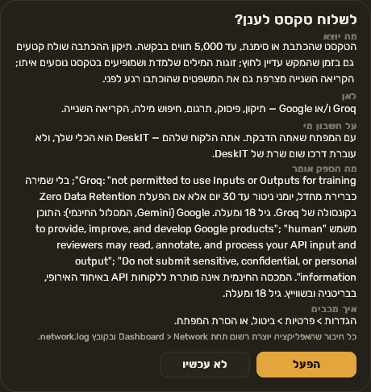
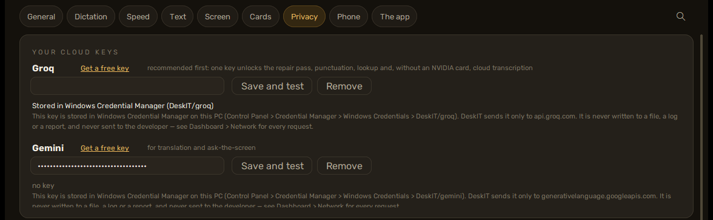

[עברית](../he/05-cloud) · English

# 5. Cloud features

**The two-sentence version.** Everything works without the cloud; the cloud features are
extras that run under *your own* free key from Groq or Google, and each one asks you once, on
a card that says exactly what leaves. Nothing is sent until you press **Turn on** on that
card.

## What each feature sends

| feature | what leaves this PC | to whom |
|---|---|---|
| Fix misheard words (the repair pass) | the text of what you just said — while you hold the key, stretches of it are sent before you release (rolling); up to 60 learned word pairs that appear in the text | Groq, under your Groq key (or Google under your Gemini key) |
| Punctuation, translation, lookup | the text or the selection | the same |
| The second reading's cloud pass | the text | the same |
| Cloud transcription (PCs without an NVIDIA card) | the recording of what you said, 16 kHz WAV, up to 20 MB per request | Groq or Google, under your key |
| Ask the screen | a JPEG of the region you selected (long side at most 1344 px), your question, earlier questions and answers in the same card | Groq or Google, under your key |
| Weekly update check | nothing about you: one request to api.github.com | GitHub |

Each of these is a **gate** on **Settings > Privacy > WHAT MAY LEAVE THIS PC**. A gate opens
only through its consent card — never from the settings file — and closes at once from the
same tab. The card carries the provider's own sentence about your data and the version of
those terms; when the provider changes its terms, the card comes back.

## Getting a free key

**Groq first.** One Groq key unlocks the repair pass, punctuation, lookup and, on a PC without
an NVIDIA card, cloud transcription. Create it at
[console.groq.com](https://console.groq.com) (free tier, no credit card).

**Gemini** only for translation and ask-the-screen, at
[aistudio.google.com](https://aistudio.google.com).

Then **Settings > Privacy > YOUR CLOUD KEYS**: paste the key into the masked field (it is
never shown again), press **Save and test** — "Works · N models visible" or the provider's own
error — and the key is stored. **Remove** deletes it. The sentence under each field:

> This key is stored in Windows Credential Manager on this PC (Control Panel > Credential Manager > Windows Credentials > DeskIT/groq). DeskIT sends it only to api.groq.com. It is never written to a file, a log or a report, and never sent to the developer — see Dashboard > Network for every request.

[Chapter 4](04-privacy) shows how to check that sentence yourself in two minutes.

## The providers' own words

The consent card quotes them, and so does this page, because a paraphrase is a promise DeskIT
cannot keep on someone else's behalf:

- **Groq** (Services Agreement, 2026-06-22): Groq is "not permitted to use Inputs or Outputs
  for training"; nothing is retained by default, abuse-monitoring logs up to 30 days unless
  you enable Zero Data Retention in the Groq console; 18 and over.
- **Google, Gemini API free tier** (terms, 2026-04-28): your content is used "to provide,
  improve, and develop Google products"; "human reviewers may read, annotate, and process
  your API input and output"; "Do not submit sensitive, confidential, or personal information
  to the Unpaid Services"; the free tier is not offered in the EEA, the UK and Switzerland;
  18 and over.

DeskIT does not geolocate: whether you are in one of those places is yours to observe.

## Limits and the meter

The free tiers have daily limits (Groq: thousands of requests a day; Gemini: fewer). When a
provider refuses, the feature falls back to the local path or says so; nothing is queued for
later. What you can be charged for: only a paid plan you opened yourself with the provider.
DeskIT has no paid tier and no account with the providers.

## Turning it off

**Settings > Privacy**, the gate's button: off is immediate and tears the connection down.
**Offline mode**, on the same tab, refuses every host except this computer's own
(`127.0.0.1`: Ollama, the phone, the hook) whatever the gates say; dictation keeps working.
