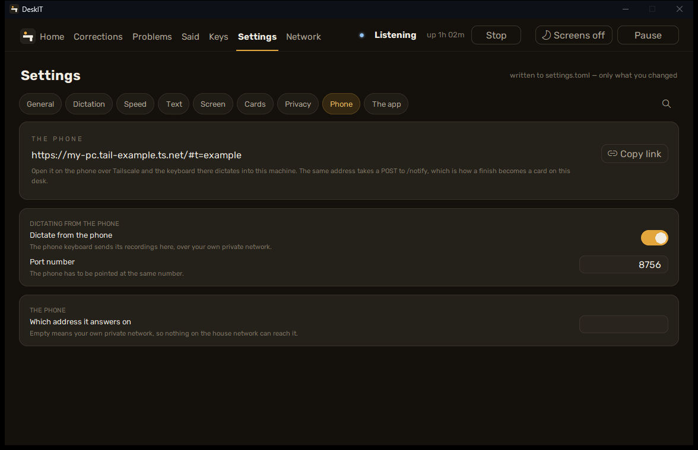

[עברית](../he/06-phone) · English

# 6. The phone keyboard

**The two-sentence version.** The DeskIT keyboard for Android records on the phone and sends
the recording to *your* PC over your own private network; your PC transcribes it with the same
Hebrew model and the same learned words, and the text lands in the field on the phone. No
relay, no server of ours in between.

## What you need

- DeskIT running on the PC with **Dictate from your phone** on (the wizard's last page, or
  **Settings > Phone**).
- **Tailscale** on the PC and on the phone, signed into the same account — this version
  reaches the PC over your Tailscale network only. Pairing over home Wi-Fi without Tailscale
  is planned for a later version.
- The keyboard APK from the [latest release](https://github.com/DeskIT-app/DeskIT/releases/latest)
  (`DeskIT-keyboard-x.y.z.apk`); a Play listing comes later.

## Setting it up

1. Install Tailscale on both devices; confirm the PC has an address with `tailscale ip -4`.
2. Turn **Dictate from your phone** on. **Settings > Phone** shows the address the PC listens
   on and a **Copy link** button.

   
3. Give the address HTTPS, once, in a terminal on the PC:

   ```
   tailscale serve --bg 8756
   ```

   Android refuses the microphone on a page that is not a secure context; this fronts the
   listener with a real certificate at `https://<pc>.<tailnet>.ts.net/`.
4. Install the APK on the phone, open the DeskIT keyboard app, paste the whole link from
   **Settings > Phone** into its first field (it splits the address and the token for you),
   grant the microphone, and enable the keyboard under Android's keyboard settings.
   **Save and test** sends one second of silence to prove the whole path.
5. In any app: switch to the DeskIT keyboard, hold the microphone key, speak, release.

## What leaves the phone, and where

- The recording goes to your PC only, over TLS, to the address you pasted. Nothing goes to
  the developer, and there is no relay.
- The PC does the transcription; the phone shows the result. What you taught DeskIT at the
  desk (learned words, the repair pass if you turned it on) applies to the phone's text too —
  under the same consent switches as at the desk. If the cloud repair is on at the desk, the
  phone's text goes through it as well.
- The keyboard refuses to work in password fields.
- **Forget** on the phone removes the address and the token; turning the switch off on the PC
  stops it listening.

## Trouble

- "Cannot connect": is Tailscale up on both, and is the PC's DeskIT running with the switch
  on? The dashboard's foot says `phone live` when the listener is up.
- Another program holds port 8756: DeskIT falls through to the next free port and
  **Settings > Phone** shows the one in use; paste the link again on the phone.
- Windows Firewall asks once whether DeskIT may accept connections: allow it on **Private**
  networks.
