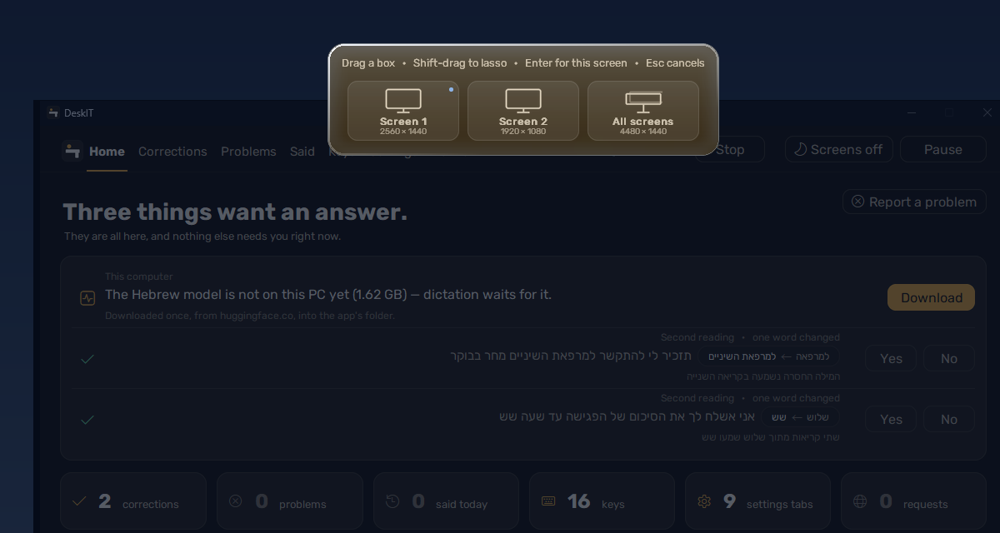
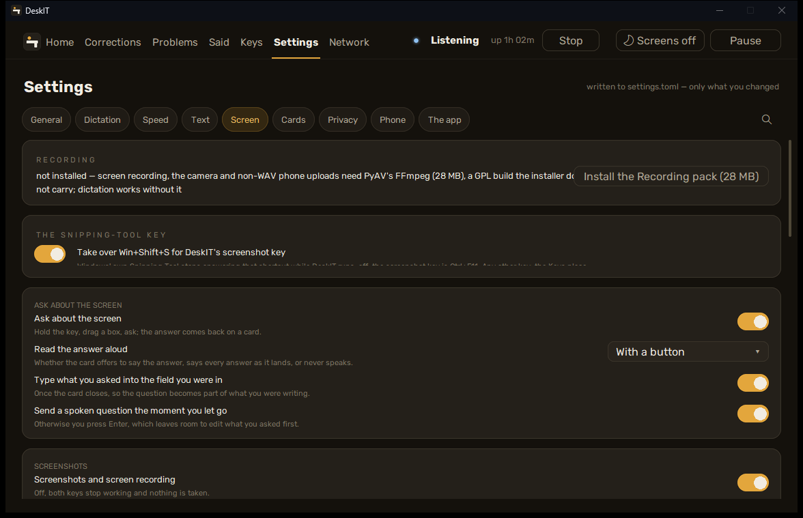
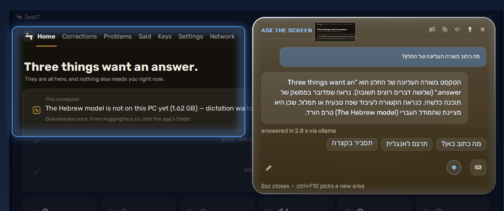
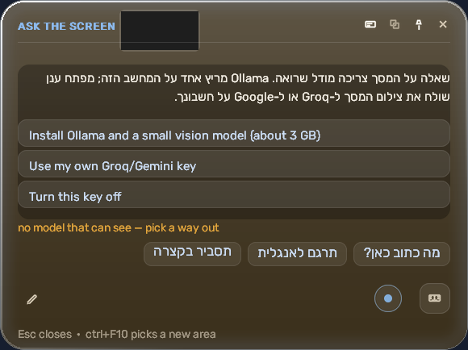

[עברית](../he/07-screen) · English

# 7. Screenshots, recordings, the camera

**The two-sentence version.** DeskIT has a screenshot key, a screen-recording key, a camera key
and an ask-the-screen key; everything they produce stays in your folder unless you ask a cloud
model about a picture. The clipboard gets a copy of every capture, and Windows may do things
with your clipboard that DeskIT does not.

## The keys

| key | does | where the file goes |
|---|---|---|
| Win+Shift+S (or Ctrl+F11 if you left the Snipping-Tool switch off) | screenshot: drag a region, or tap for the window under the mouse; an editor with a pencil opens | `%LOCALAPPDATA%\DeskIT\captures` |
| Ctrl+F12 | record the screen; tap again to stop | `captures` as well, `clip-*.mp4` |
| Ctrl+F6 | a photo from the camera — the light beside the lens goes off at the shutter, and that is a real promise | `captures` |
| Ctrl+F10 | ask about the screen: select a region, a card opens, ask in Hebrew by voice or by typing | nothing saved; the picture lives in memory while the card is open |

**Screen recording and the camera need the Recording pack**: PyAV with its FFmpeg, 28 MB from
PyPI, installed from **Settings > Screen** with one button. The installer does not carry it
because that FFmpeg build is GPL (x264, x265); the card shows the licences before the download,
and dictation works without it.

**Settings > Screen** changes the folders, the recorder's frame rate, whether recordings
include computer sound (then the microphone is opened when audio is "mic"), and the
Snipping-Tool switch: while DeskIT runs and the switch is on, Windows' own Snipping Tool stops
answering Win+Shift+S.

## Ask the screen

The card needs a model that can see. Three ways, and the card offers them when none is set:

- **Ollama on this PC** (free, local): install it from ollama.com and pull the model the card
  names for your card (`gemma3:4b` on smaller cards, `gemma3:12b` on 12 GB and up). DeskIT
  finds Ollama on `127.0.0.1:11434` by itself. Not recommended on a PC without an NVIDIA
  card — the answer would take minutes.
- **Your own Groq or Gemini key**: the card opens the consent card first, because a JPEG of
  the region (long side at most 1344 px) and your question then leave this PC to that
  provider under your key ([chapter 5](05-cloud)).
- **Turn this key off** if you do not want it.

Every answer says which backend answered and how long it took ("answered in 2.1 s via
ollama").

## The clipboard caveat

Every capture is put on the Windows clipboard so you can paste it at once. Windows clipboard
history (Win+V) keeps recent items if you turned it on, and Windows' *cloud clipboard sync*
would send them to Microsoft — that is a Windows setting (Settings > System > Clipboard), not
DeskIT's, and DeskIT cannot tell whether it is on.
