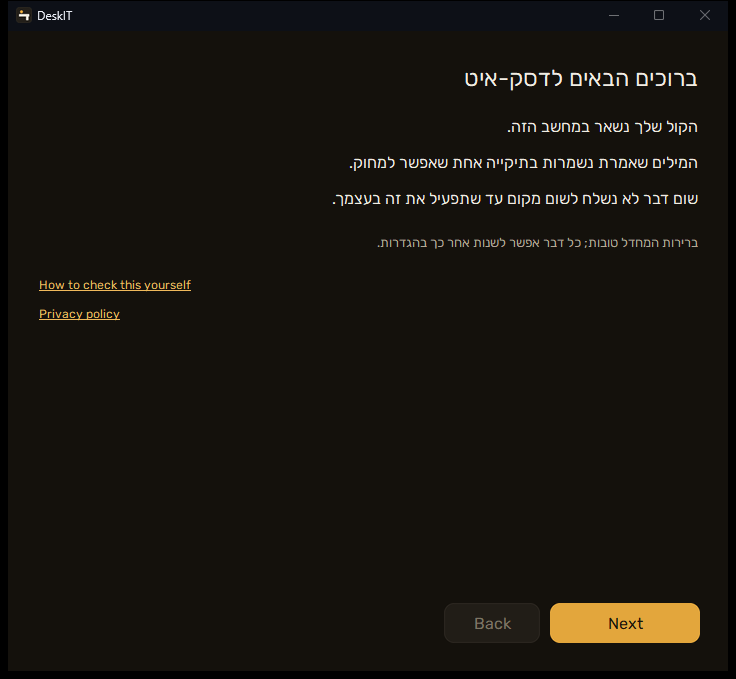
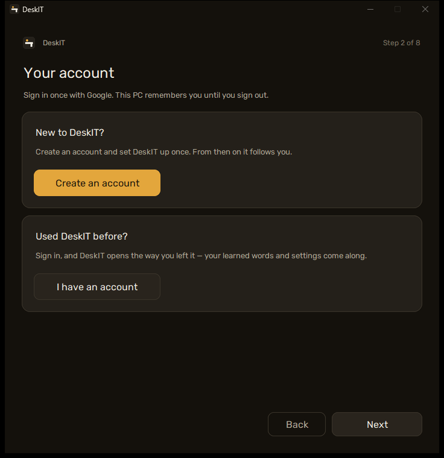
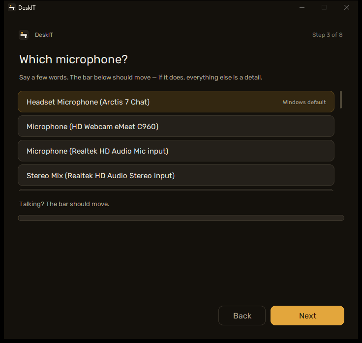
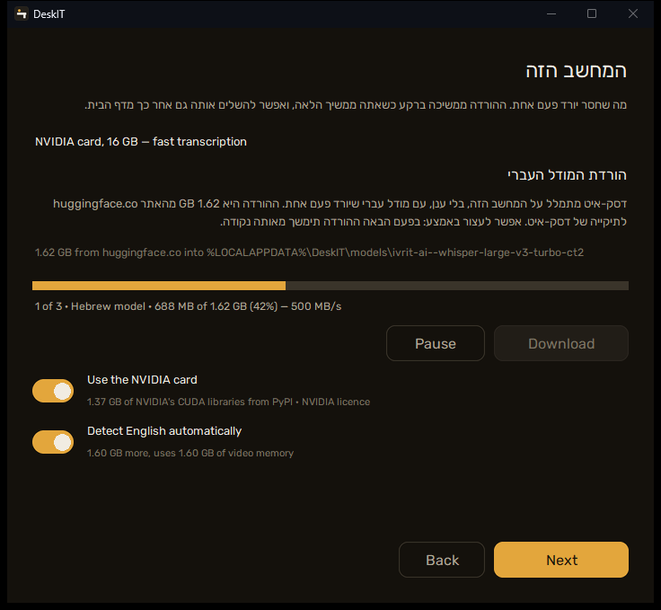
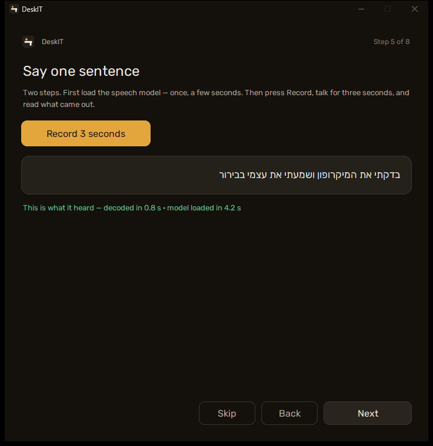
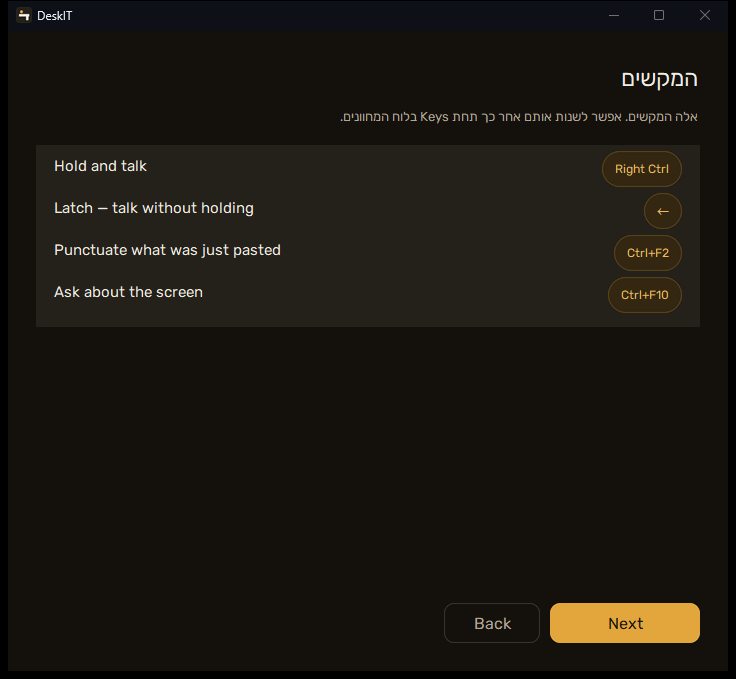
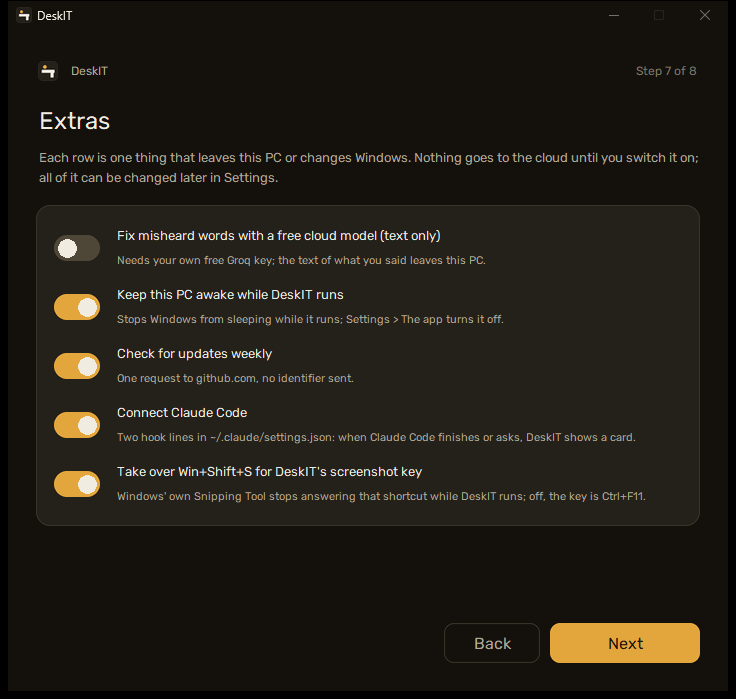
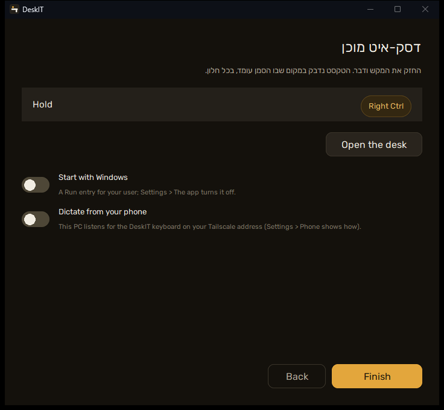

עברית · [English](../en/02-first-run)

# 2. הפעלה ראשונה

**בשני משפטים.** ההפעלה הראשונה פותחת אשף של שבעה דפים; רק שלושה שואלים משהו (איזה
מיקרופון, אם להוריד עכשיו, ומה עם התוספות) וכל השאר הוא **Next**. הוא רץ פעם אחת;
`main.py --setup` מתיקיית ההתקנה מריץ אותו שוב. אחריו, על שולחן העבודה, סיור של ארבעה
כרטיסים ליד הנקודה — זה המדריך; הדף הזה הוא הגרסה הארוכה שלו. מאז שהמתקין מוריד בעצמו
את המודל והחבילות ([פרק 1](01-install)), עמוד "המחשב הזה" בדרך כלל מדולג — הוא מופיע רק
בשביל מה שביטלת שם או מה שלא הסתיים.

## הסיור

כשהאשף נסגר מופיע כרטיס קטן ליד הנקודה בפינת המסך, עם חץ שמצביע עליה. ארבעה כרטיסים,
משפט אחד בכל אחד: מה הנקודה וצבעיה, המקש (מצויר, עם המקש שבחרת), מה נפתח בלחיצה על
הנקודה, וסיום. **הבא** מתקדם, **דלג** סוגר — ומי שדילג לא יראה אותו שוב מעצמו.
לראות שוב: הגדרות ← The app ← **Show the tour**.

## ברוכים הבאים

שלושה משפטים על לאן הקול שלך הולך — הוא נשאר במחשב הזה, המילים נשמרות בתיקייה אחת שאפשר
למחוק, שום דבר לא נשלח לשום מקום עד שתפעיל את זה — וקישור, **How to check this yourself**,
ל[פרק 4](04-privacy). **Next**.

## החשבון שלך

שני כרטיסים, שאלה אחת בכל אחד. אין דרך לעבור את העמוד הזה בלי חשבון.

**חדש בדסק-איט?** — **Create an account**. שדה לשם שלך (כך דסק-איט קורא לך — החשבון צריך
שם, ולכן **Continue with Google** נדלק רק אחרי שהקלדת אותו), בשביל מה החשבון (המילים שלמדת
וההגדרות הולכות איתך לכל מחשב שתתחבר בו), מה נשמר (המזהה והאימייל של חשבון גוגל שתבחר, השם
שהקלדת) ומה לעולם לא (הקול שלך, מה שאמרת, המפתחות שלך). **Continue with Google** פותח את
הדפדפן פעם אחת; המחשב הזה זוכר אותך עד שתתנתק, ושאר ההתקנה ממשיכה.

**כבר השתמשת בדסק-איט?** — **I have an account**. **Sign in with Google** עם החשבון שהיה לך
במחשב האחר, וזה הכול: המילים שלמדת וההגדרות יורדות ודסק-איט נפתח מעצמו — בלי עמודי
המיקרופון, המשפט, המקשים והתוספות; רק עמוד ההורדות, אם למחשב הזה עדיין חסר משהו. המיקרופון
והמקשים הם הרגילים עד שתשנה אותם ב־Settings. מפתח ה־Groq שלך לעולם לא בחשבון: מדביקים
אותו פעם אחת במחשב החדש (Settings ‹ Privacy).

בחרת בכרטיס הלא נכון? קישור מתחת לכל אחד מוביל לשני, ו־**Back** חוזר לשני הכרטיסים, לא
לעמוד הפתיחה. התחברת בתור האדם הלא נכון? **Not you? Sign out** מתחת לכרטיס המחובר (או
**Back**) מנתק את המחשב הזה — שאר המחשבים שלך נשארים מחוברים — ומראה שוב את שני הכרטיסים.
יצרת חשבון עם חשבון גוגל שכבר יש בו הגדרות של דסק-איט? העמוד אומר *ברוך שובך* והכפתור אומר
**Open DeskIT**. התחברת עם חשבון שעדיין אין בו כלום? העמוד אומר זאת, ו־**Continue** מריץ את
ההתקנה הרגילה.

## מיקרופון

כל התקן קלט שחלונות מכיר, זה שחלונות קורא לו ברירת מחדל כבר מסומן, ופס מתחת לרשימה.
**מדברים. הפס צריך לזוז.** אם הוא זז, כל השאר פרטים.

אם הוא לא זז, הסיבה כמעט תמיד היא מתג הפרטיות של המיקרופון בחלונות, לא תקלה: חלונות
מאפשר לחסום אפליקציות שולחן עבודה מהמיקרופון ואז מגיש להן שקט מושלם, בלי שגיאה. האשף קורא
את המתג הזה עוד לפני שהפס מצויר, וכשהוא כבוי אומר זאת ומציע **Open the Windows setting**
(הגדרות > פרטיות ואבטחה > מיקרופון > *אפשר לאפליקציות שולחן עבודה לגשת למיקרופון*).
מדליקים, חוזרים, מדברים שוב.

בוחרים שורה אחרת אם יש יותר ממיקרופון אחד. **Next** שומר את הבחירה.

## המחשב הזה

העמוד הזה קיים רק כל עוד נשאר מה להוריד — אחרי התקנה שבה השארת את עמוד ההורדות כמו
שהוא, הוא לא מוצג בכלל, והמונה אומר "מתוך 6".

השורה העליונה היא מה שדסק-איט מצא: כרטיס אנבידיה והזיכרון שלו ("תמלול מהיר"), כרטיס
אנבידיה קטן ("מהיר, מצב מוקטן"), או בלי כרטיס אנבידיה ("התמלול ייקח בערך כמו שדיברת").
מתחת — מה שהמחשב הזה עוד צריך, כל דבר נשאל לפני שבייט אחד זז:

- **המודל העברי** — 1.62 ג׳יגה מ־huggingface.co לתוך `%LOCALAPPDATA%\DeskIT\models`.
  לוחצים **Download**; הפס מראה בייטים, אחוזים ומהירות, **Pause** שומר מה שכבר ירד וההפעלה
  הבאה ממשיכה משם. אפשר ללחוץ **Next** בזמן ההורדה, או לדלג ולהוריד מ**Home** ביום אחר —
  דסק-איט נפתח גם בלי, והכתבה אז אומרת שהמודל חסר ושומרת את ההקלטה.
- **Use the NVIDIA card** (רק במחשב שיש בו כרטיס): 1.37 ג׳יגה של ספריות CUDA של אנבידיה
  מ־PyPI, תחת הרישיון של אנבידיה (מקושר). בלעדיהן כרטיס אנבידיה רץ כמו מעבד.
- **Detect English automatically** (רק בכרטיס אנבידיה גדול): מודל שני, כללי, שמזהה
  כשדיברת אנגלית ומתמלל אותה כאנגלית. עוד 1.60 ג׳יגה בדיסק ובזיכרון הכרטיס.
- **Screen recording and the camera**: 28 מגה מ־PyPI — PyAV עם FFmpeg, למקש ההקלטה,
  למקש הצילום ולאודיו מהטלפון. דלוק כברירת מחדל, כדי שלא יהיה מה להתקין אחר כך; שני
  הרישיונות מקושרים בכרטיס.

המתגים נעמדים בתור אחרי המודל: **Download** אחד, פס אחד, "1 of 3 · Hebrew model". זה קורה
רק פעם אחת.

## משפט אחד

**Record 3 seconds**, מדברים, וקוראים מה חזר — דרך המנוע האמיתי, אותו מנוע שכל הכתבה
אחר כך משתמשת בו. השורה מתחת אומרת כמה זמן לקח התמלול; במחשב בלי כרטיס אנבידיה המספר
הזה הוא המהירות שיש לצפות לה. הכפתור מחכה כל עוד המודל עוד יורד; **Skip** ממשיך בלעדיו.

## מקשים

מקשי המקלדת שדסק-איט מאזין להם — להחזיק, לנעול, לפסק, לשאול על המסך — כפי שהם עכשיו. אלה
מקשי מקלדת, לא מפתחות API; מפתחות הענן מגיעים ב[פרק 5](05-cloud). משנים אותם אחר כך במקום
**Keys** בלוח המחוונים.

## תוספות

חמישה מתגים, כל אחד דבר אחד שיוצא מהמחשב או משנה משהו בחלונות. הם מצוירים כפי שהם,
ונכתבים רק אם הזזת אותם:

| מתג | מה הוא עושה |
|---|---|
| Fix misheard words with a free cloud model (text only) | כבוי. ההדלקה היא ההסכמה ([פרק 5](05-cloud) אומר מה יוצא ולאן) ופותחת מתחת לשורה שדה למפתח Groq חינמי משלך, שנבדק מול Groq ברגע השמירה. Next מחכה עד שמפתח עובד — או עד שהמתג כבוי שוב. |
| Keep this PC awake while DeskIT runs | דלוק. חלונות לא נרדם כל עוד דסק-איט רץ; **Settings > The app** מכבה. |
| Check for updates weekly | דלוק. בקשה אחת ל־github.com, בלי מזהה. |
| Connect Claude Code | כבוי. שתי שורות ב־`~/.claude/settings.json`: כש־Claude Code מסיים או שואל, דסק-איט מציג כרטיס ומשמיע צליל. |
| Take over Win+Shift+S for DeskIT's screenshot key | דלוק. כלי החיתוך של חלונות מפסיק לענות לקיצור הזה כל עוד דסק-איט רץ; כבוי — המקש הוא Ctrl+F11. |

## מוכן

המקש שמחזיקים, ושלושה מתגים שנשאלים פעם אחת:

- **Keep my learned words and settings in my account** — דלוק. המילים שדסק-איט למד ממך
  וההגדרות ששינית הולכות איתך לכל מחשב שתיכנס אליו עם החשבון, כך שהוא שומע אותך בדרך
  שלך כבר מהמשפט הראשון. אף פעם לא הקול, המפתחות או מה שאמרת (לעמוד Said יש מתג
  משלו, כבוי, תחת Settings > Privacy). לכבות אחר כך: Settings > Privacy > **Withdraw**
  בשורה *Syncing settings and words*; **Sync now** תחת Account שואל שוב. השורה מופיעה רק
  אם נכנסת לחשבון בעמוד החשבון.
- **Start with Windows** — כבוי. רשומת הפעלה למשתמש שלך; ההפעלה הזאת לא פותחת חלון, רק
  את הנקודה.
- **Dictate from your phone** — כבוי ([פרק 6](06-phone)).

**Start** מפעיל את דסק-איט ופותח את הדסק. אם דילגת על המודל, הדף אומר זאת ול־Home יש את
כפתור ההורדה.
