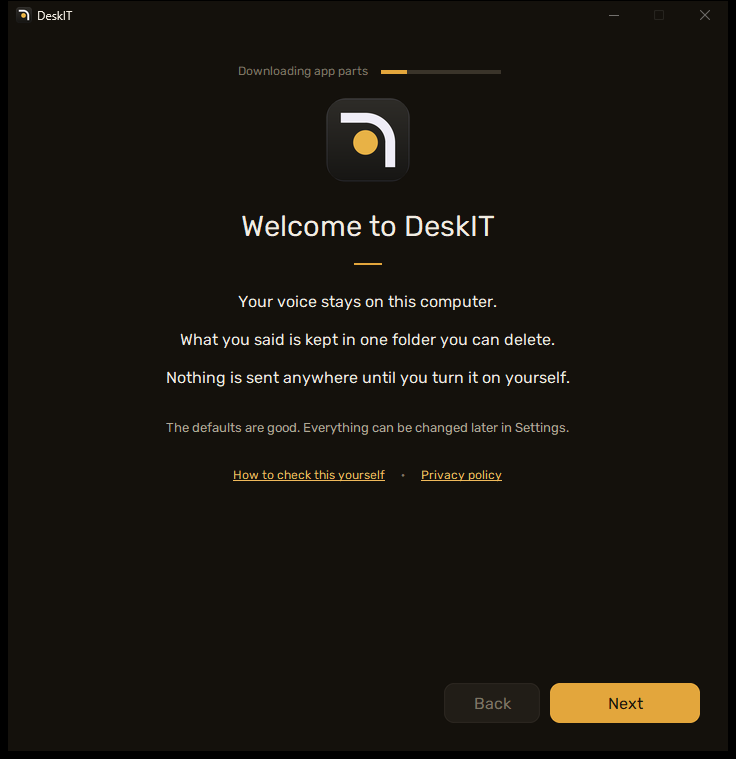
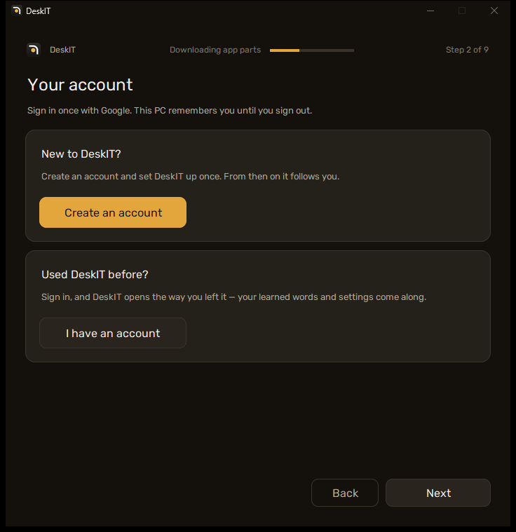
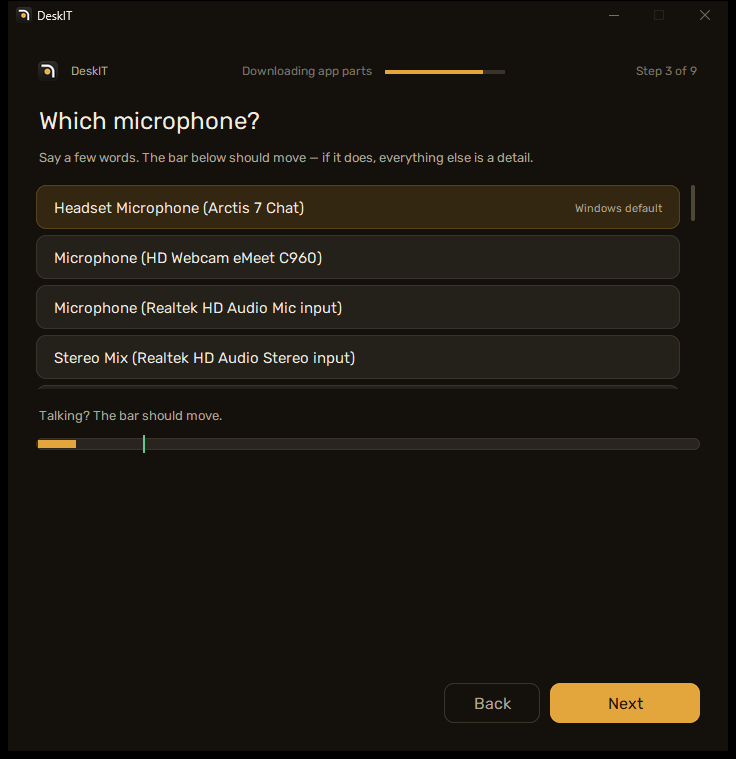
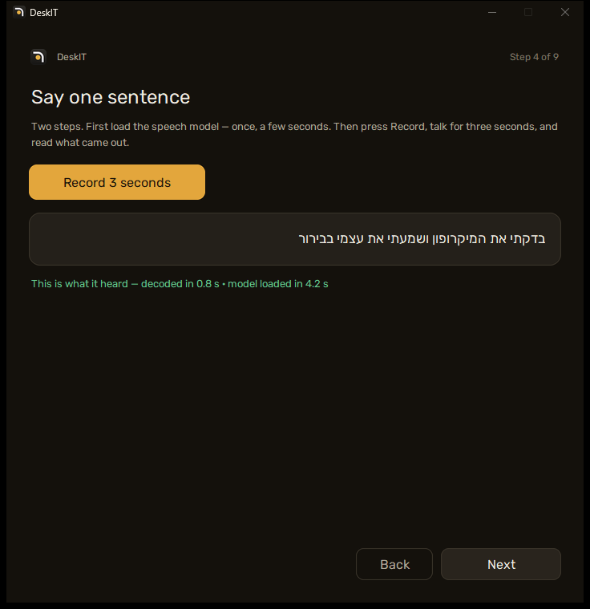
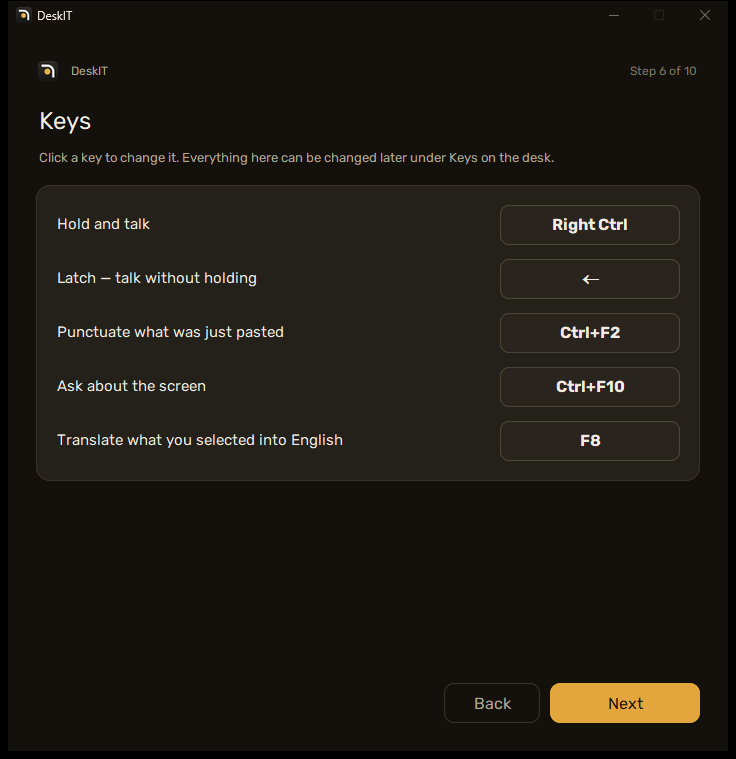
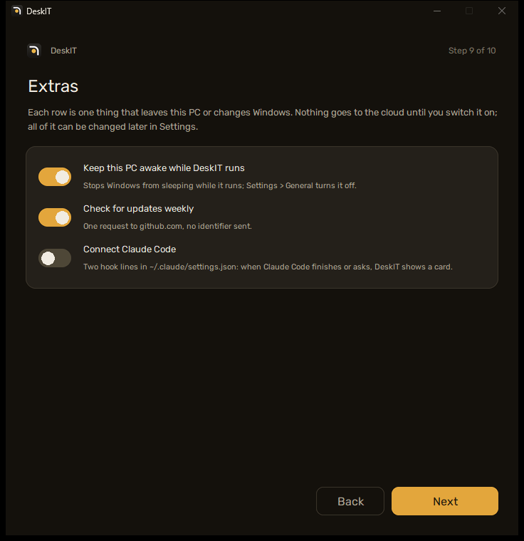
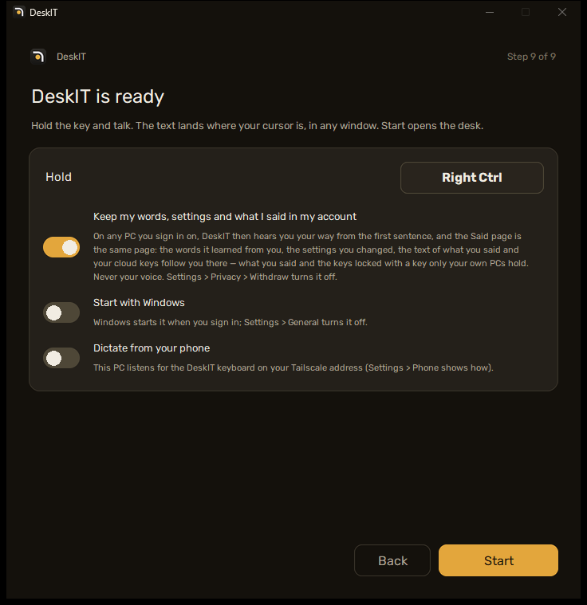

עברית · [English](../en/02-first-run)

# 2. הפעלה ראשונה

**בשני משפטים.** ההפעלה הראשונה פותחת אשף של שבעה דפים; רק שניים שואלים משהו (איזה
מיקרופון, ומה עם התוספות) וכל השאר הוא **Next**. הוא רץ פעם אחת;
`main.py --setup` מתיקיית ההתקנה מריץ אותו שוב. אחריו, על שולחן העבודה, סיור של ארבעה
כרטיסים ליד הנקודה — זה המדריך; הדף הזה הוא הגרסה הארוכה שלו. כל מה שדסק-איט צריך יורד
לבד, ברקע, מהשנייה הראשונה — ראו "ההורדות" למטה.

## הסיור

כשהאשף נסגר מופיע כרטיס קטן ליד הנקודה בפינת המסך, עם חץ שמצביע עליה. ארבעה כרטיסים,
משפט אחד בכל אחד: מה הנקודה וצבעיה, המקש (מצויר, עם המקש שבחרת), מה נפתח בלחיצה על
הנקודה, וסיום. **הבא** מתקדם, **דלג** סוגר — ומי שדילג לא יראה אותו שוב מעצמו.
לראות שוב: הגדרות ← The app ← **Show the tour**.

## ברוכים הבאים

שלושה משפטים על לאן הקול שלך הולך — הוא נשאר במחשב הזה, המילים נשמרות בתיקייה אחת שאפשר
למחוק, שום דבר לא נשלח לשום מקום עד שתפעיל את זה — וקישור, **How to check this yourself**,
ל[פרק 4](04-privacy). **Next**.

## החשבון שלך

שני כרטיסים, שאלה אחת בכל אחד. אין דרך לעבור את העמוד הזה בלי חשבון.

**חדש בדסק-איט?** — **Create an account**. שדה לשם שלך (כך דסק-איט קורא לך — החשבון צריך
שם, ולכן **Continue with Google** נדלק רק אחרי שהקלדת אותו), בשביל מה החשבון (המילים שלמדת
וההגדרות הולכות איתך לכל מחשב שתתחבר בו), מה נשמר (המזהה והאימייל של חשבון גוגל שתבחר, השם
שהקלדת), ושרק הקול שלך לא יוצא מהמחשב הזה לעולם: המילים שלמד וההגדרות נשמרים בחשבון שלך,
וגם מה שאמרת ומפתחות הענן שלך — נעולים במפתח שרק המחשבים שלך מחזיקים (העמוד האחרון מכבה
את זה). **Continue with Google** פותח את
הדפדפן פעם אחת; המחשב הזה זוכר אותך עד שתתנתק, ושאר ההתקנה ממשיכה.

**כבר השתמשת בדסק-איט?** — **I have an account**. **Sign in with Google** עם החשבון שהיה לך
במחשב האחר, וזה הכול: המילים שלמדת, ההגדרות ומה שאמרת יורדים ודסק-איט נפתח מעצמו — בלי עמודי
המיקרופון, המשפט, המקשים והתוספות; רק עמוד ההורדות, אם למחשב הזה עדיין חסר משהו. המיקרופון
והמקשים הם הרגילים עד שתשנה אותם ב־Settings. מה שאמרת ומפתחות הענן נעולים במפתח שרק
המחשבים שלך מחזיקים, ולכן עוד צעד אחד: העמוד מציג קוד של עשרה תווים ומחכה; פותחים את
השולחן במחשב האחר — מסך הבית שם מציג את אותו קוד — ולוחצים **Approve**. כל מה שנעול מגיע
אז גם לכאן. אין מחשב אחר ליד? מקלידים את מפתח השחזור שדסק-איט יצר לך (Settings ‹ Privacy ‹
The lock, בכל מחשב שכבר בפנים). או **Later**: בינתיים דסק-איט עובד עם המילים וההגדרות,
וכרטיס החשבון בשולחן שומר את הקוד.

בחרת בכרטיס הלא נכון? קישור מתחת לכל אחד מוביל לשני, ו־**Back** חוזר לשני הכרטיסים, לא
לעמוד הפתיחה. התחברת בתור האדם הלא נכון? **Not you? Sign out** מתחת לכרטיס המחובר (או
**Back**) מנתק את המחשב הזה — שאר המחשבים שלך נשארים מחוברים — ומראה שוב את שני הכרטיסים.
יצרת חשבון עם חשבון גוגל שכבר יש בו הגדרות של דסק-איט? העמוד אומר *ברוך שובך* והכפתור אומר
**Open DeskIT**. התחברת עם חשבון שעדיין אין בו כלום? העמוד אומר זאת, ו־**Continue** מריץ את
ההתקנה הרגילה.

## מיקרופון

כל התקן קלט שחלונות מכיר, זה שחלונות קורא לו ברירת מחדל כבר מסומן, ופס מתחת לרשימה.
**מדברים. הפס צריך לזוז.** אם הוא זז, כל השאר פרטים.

אם הוא לא זז, הסיבה כמעט תמיד היא מתג הפרטיות של המיקרופון בחלונות, לא תקלה: חלונות
מאפשר לחסום אפליקציות שולחן עבודה מהמיקרופון ואז מגיש להן שקט מושלם, בלי שגיאה. האשף קורא
את המתג הזה עוד לפני שהפס מצויר, וכשהוא כבוי אומר זאת ומציע **Open the Windows setting**
(הגדרות > פרטיות ואבטחה > מיקרופון > *אפשר לאפליקציות שולחן עבודה לגשת למיקרופון*).
מדליקים, חוזרים, מדברים שוב.

בוחרים שורה אחרת אם יש יותר ממיקרופון אחד. **Next** שומר את הבחירה.

## ההורדות

אין להן עמוד. ברגע שהאשף נפתח, דסק-איט מתחיל להוריד כל חלק שהמחשב הזה יכול להשתמש בו —
המודל העברי (1.6 ג׳יגה), חבילת ההקלטה למקשי ההקלטה והמצלמה (28 מגה), ובמחשב עם כרטיס
אנבידיה גם הספריות שלו (1.4 ג׳יגה), ובכרטיס גדול גם מזהה האנגלית (1.6 ג׳יגה) — ברקע, פעם אחת.
הסימן היחיד הוא פס דק בראש כל דף, **Downloading app parts**; הוא נעלם כשהכול ירד, ולחיצה על
המילים פותחת את [הטבלה של מה כל חלק](01-install#downloads). בלי חיבור הפס אומר זאת, ודסק-איט
ממשיך לנסות לבד.

מה שעוד יורד כשלוחצים **Start** ממשיך לרדת באפליקציה, ו־**Home** אומר כמה נשאר. עותק שהמתקין
שלו כבר הוריד הכול לא מראה פס בכלל.

## משפט אחד

**Record 3 seconds**, מדברים, וקוראים מה חזר — דרך המנוע האמיתי, אותו מנוע שכל הכתבה
אחר כך משתמשת בו. השורה מתחת אומרת כמה זמן לקח התמלול; במחשב בלי כרטיס אנבידיה המספר
הזה הוא המהירות שיש לצפות לה. הכפתור מחכה כל עוד המודל עוד יורד; **Skip** ממשיך בלעדיו.

## מקשים

מקשי המקלדת שדסק-איט מאזין להם — להחזיק, לנעול, לפסק, לשאול על המסך — כפי שהם עכשיו. אלה
מקשי מקלדת, לא מפתחות API; מפתחות הענן מגיעים ב[פרק 5](05-cloud). משנים אותם אחר כך במקום
**Keys** בלוח המחוונים.

## תוספות

חמישה מתגים, כל אחד דבר אחד שיוצא מהמחשב או משנה משהו בחלונות. הם מצוירים כפי שהם,
ונכתבים רק אם הזזת אותם:

| מתג | מה הוא עושה |
|---|---|
| Fix misheard words with a free cloud model (text only) | כבוי. ההדלקה היא ההסכמה ([פרק 5](05-cloud) אומר מה יוצא ולאן) ופותחת מתחת לשורה שדה למפתח Groq חינמי משלך, שנבדק מול Groq ברגע השמירה. Next מחכה עד שמפתח עובד — או עד שהמתג כבוי שוב. |
| Keep this PC awake while DeskIT runs | דלוק. חלונות לא נרדם כל עוד דסק-איט רץ; **Settings > General** מכבה. |
| Check for updates weekly | דלוק. בקשה אחת ל־github.com, בלי מזהה. |
| Connect Claude Code | כבוי. שתי שורות ב־`~/.claude/settings.json`: כש־Claude Code מסיים או שואל, דסק-איט מציג כרטיס ומשמיע צליל. עותק אחד של דסק-איט בכל פעם: אם עותק אחר במחשב הזה מחובר, השורה אומרת זאת וההדלקה שואלת קודם — עונים *Yes, connect this one* והעותק האחר מתנתק. |
| Take over Win+Shift+S for DeskIT's screenshot key | דלוק. כלי החיתוך של חלונות מפסיק לענות לקיצור הזה כל עוד דסק-איט רץ; כבוי — המקש הוא Ctrl+F11. |

## מוכן

המקש שמחזיקים, ושלושה מתגים שנשאלים פעם אחת:

- **Keep my words, settings and what I said in my account** — דלוק. המילים שדסק-איט למד
  ממך, ההגדרות ששינית, הטקסט של מה שאמרת ומפתחות הענן הולכים איתך לכל מחשב שתיכנס אליו עם
  החשבון, כך שהוא שומע אותך בדרך שלך כבר מהמשפט הראשון ועמוד Said הוא אותו עמוד גם שם. מה
  שאמרת והמפתחות יוצאים נעולים במפתח שרק המחשבים שלך מחזיקים; השרת לא יכול לקרוא אותם.
  אף פעם לא הקול. לכבות אחר כך: Settings > Account > **Withdraw** בשורה *Syncing settings
  and words* ובשורה *Syncing what you said* — לכל אחת שורה משלה, אז אפשר לכבות רק את
  ההיסטוריה; **Turn on** באותה שורה שואל שוב. השורה מופיעה רק אם נכנסת לחשבון בעמוד
  החשבון.
- **Start with Windows** — כבוי. רשומת הפעלה למשתמש שלך; ההפעלה הזאת לא פותחת חלון, רק
  את הנקודה.
- **Dictate from your phone** — כבוי ([פרק 6](06-phone)).

**Start** מפעיל את דסק-איט ופותח את הדסק. אם דילגת על המודל, הדף אומר זאת ול־Home יש את
כפתור ההורדה.
