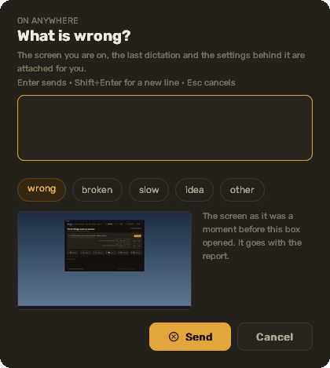

עברית · [English](../en/09-reporting)

# 9. דיווח על בעיה

**בשני משפטים.** נוקשים **Ctrl+Alt+R**, כותבים שורה אחת, לוחצים Enter: הדיווח נשמר במחשב הזה
עם המסך, ההכתבה האחרונה וההגדרות מצורפים. מדליקים **Send to the developer** ורואים, לפני
שמשהו יוצא, בדיוק מה ייצא — כל קובץ עם הגודל שלו והשורה האחת שהשרת מקבל — ורק הלחיצה שלך
על **Send** שולחת.

## מקש הדיווח

בכל מקום, **Ctrl+Alt+R** פותח תיבה קטנה מעל החלון: **What is wrong?**, שורה אחת בעברית
(Shift+Enter לשורה חדשה), וחמישה סוגים — wrong / broken / slow / idea / other. התיבה מצרפת
בשבילך: צילום של המסך שמתחת לעכבר, הטקסט וההקלטה של ההכתבה האחרונה, ותצלום של ההגדרות שלך
(מפתחות אף פעם; התצלום עובר את אותו מנקה כמו היומן). Enter שומר; Esc מבטל.



מקום **Problems** בלוח המחוונים מציג את הדיווחים שלך, פותח את התיקייה של כל אחד
(`%LOCALAPPDATA%\DeskIT\problems\<id>\`), ויש בו אותה תיבה לדיווח שנכתב מהשולחן.

שום דבר לא יוצא מהמחשב אלא אם מדליקים **Send to the developer** בתיבה. בפעם הראשונה כרטיס
ההסכמה שליד הנקודה שואל (Settings > Privacy מבטל אחר כך). כשהמתג דולק, רצועה מתחתיו מונה מה
ייסע, כל פריט עם הגודל שלו ומתג משלו: **Screenshot** (כבוי אלא אם תדליק — תמונה של המסך
עלולה להכיל מילים של מישהו אחר), **Recording** (כבוי), **Transcript text** (דולק ב־"wrong"),
**Settings snapshot** (דולק: שמות מודלים ומתגים, אף פעם לא מפתח). הכפתור אז אומר **Preview**
במקום **Keep on this PC**: הדיווח נשמר כאן כרגיל, ונפתח חלון עם הקבצים והשורה המדויקת —
"This is everything that leaves your PC. Nothing else." — ושני כפתורים, **Send** ו־**Keep on
this PC**. סגירת החלון היא שמירה כאן.

מתיבת המקש אותה תצוגה מקדימה נפתחת במקום **Problems** בשולחן; דיווח שלא ענית עליו שם שומר
כפתור **Preview & send** בשורה שלו. שורה של דיווח שנשלח אומרת "waiting to send" עד שיצא
(האפליקציה שולחת כשהיא מקוונת; **Send now** מזרז), ואז "sent to the developer"; דיווח שהשרת
דחה אומר למה. כל עותק אידמפוטנטי: לשלוח את אותו דיווח פעמיים לא יוצר שניים.

## לספר לנו

**GitHub Issues** — [תבנית הבאג](https://github.com/DeskIT-app/DeskIT/issues/new/choose) שואלת
מה עשית, מה קרה, למה ציפית, איך התקנת, ובלוק האבחון. מקבלים את הבלוק ב־**Settings > About > Copy diagnostics**, או מתיקיית ההתקנה:

```
python\python.exe app\main.py --diagnose
```

הוא מכיל את הגרסה, השכבה, מספר הבנייה של חלונות, מצב המודל והחבילות, הפורט, ו־50 השורות
האחרונות של `app.log` דרך המנקה — בלי תמלולים ובלי מפתחות. הבלוק מתחיל בשורה שאומרת מה יש
בו; קוראים אותו לפני שמדביקים.

**Windows Defender או SmartScreen סימנו את המתקין?** יש תבנית שנייה לזה (שם הזיהוי, שם
הקובץ, קישור ה־VirusTotal מדף הגרסה), והטופס של מיקרוסופט לדיווח על זיהוי שגוי מקושר מדף
הגרסה.

**בעיית אבטחה** — משהו שמאפשר למפתח, לתמלול או להקלטה לצאת מהמחשב בלי הסכמתך — הולך
במייל, לא ב־issue פומבי: `SECURITY.md` שליד התוכנה מכיל את הכתובת וחלון גילוי של 90 יום.

## מה המפתח רואה

מה שהתצוגה המקדימה הראתה ותו לא: השורה (סוג, מקום, השורה שלך, גרסה, מספר בנייה של חלונות,
שכבה, תצלום ההגדרות אם השארת דולק, התמלול אם השארת דולק) והקבצים שסימנת, תחת החשבון שלך
(אנונימי או Google — אימייל אף פעם לא נמצא בדיווח). **Delete my account** בכרטיס החשבון
ב־Home מסיר כל דיווח וקובץ מצד המפתח.
